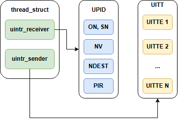

## 支持用户态中断的新型操作系统内核设计 中期报告

左晨阳 2022010896

### 一、背景概述

#### 1. intel uintr

2021 年 5 月，Intel 在 x86 指令集架构拓展中引入了用户态中断（uintr）。这一机制允许中断接收方为用户态进程，而发送方可以是用户态进程、内核或者外设。涉及到的新增指令如下：

| 指令名称  | 二进制形式         | 描述 |
|----------|-------------------|------|
| SENDUIPI | 0xf3 0f c7 /reg   | 根据寄存器操作数指定的 UITTE，发送处理器间用户中断 |
| STUI     | 0xf3 0f 01 ef     | 设置 user interrupt flag (UIF) |
| CLUI     | 0xf3 0f 01 ee     | 清除 (UIF) |
| TESTUI   | 0xf3 0f 01 ed     | 将 UIF 复制到 EFLAGS.CF 中 |
| UIRET    | 0xf3 0f 01 ec     | 从用户中断处理中返回 |

涉及到的状态需要由内核维护，但也可能会被硬件修改，具体如下：

| 全称 | 描述 | 所在位置 |
|------|------|---------|
| Uintr Request Register     | 某位为 1 表示对应下标的用户态中断待处理       | IA32_UINTR_RR (985H) |
| Uintr Flag                 | 用户态中断使能                            | CPU flag  |
| Uintr Handler              | 中断处理函数入口地址                      | IA32_UINTR_HANDLER (986H) |
| Uintr Stack Adjustment     | 中断处理栈的基址或偏移量                   | IA32_UINTR_STACKADJUST (987H) |
| Uintr Notification Vector  | 识别为用户态中断处理的中断编号              | IA32_UINTR_MISC (988H) |
| UPID Address               | UPID 的地址                              | IA32_UINTR_PD (989H) |
| UITT Address               | UITT 的地址，用于 SENDUIPI                | IA32_UINTR_TT (98AH) |
| UITT Size                  | UITT 的大小                               | IA32_UINTR_MISC (988H) |

其中，UPID 和 UITT 的定义不再赘述，详见 `week5.md`。

#### 2. uintr linux kernel

Linux 主分支未引入 uintr 机制支持，Intel 发布了相关补丁。内核中，为每个接受者 task 分配 UPID 结构，为每个发送者分配 UITT 结构。UPID 为 task 独有，UITT 可以在 task 间共享。



使用 Linux 的 uintr 机制，可以用如下泳道图表示：


关于 syscall 具体逻辑详见 `week7.md`

### 二、工作进展
#### 1. 在 nimbos kernel 中添加 uintr 相关系统调用

仿照 Linux 的实现，设计如下数据结构：

```rust
#[repr(C, packed)]
#[derive(Debug, Copy, Clone)]
pub struct UintrNc {
    status: u8, // bit 0: ON, bit 1: SN, bit 2-7: reserved
    reserved1: u8, // Reserved
    nv: u8, // Notification vector
    reserved2: u8, // Reserved
    ndst: u32, // Notification destination
} // Notification control

#[repr(C, align(64))]
#[derive(Debug)]
pub struct UintrUpid {
    pub nc: UintrNc,
    pub puir: u64,
}

#[repr(C, packed)]
#[derive(Debug, Copy, Clone)]
/* User Interrupt Target Table Entry (UITTE) */
pub struct UnalignedUintrUittEntry {
    pub valid: u8, // bit 0: valid, bit 1-7: reserved
    pub user_vec: u8,
    pub reserved: [u8; 6],
    pub target_upid_addr: u64,
}

#[repr(align(16))]
#[derive(Debug, Copy, Clone)]
pub struct UintrUittEntry(pub UnalignedUintrUittEntry);

#[derive(Debug, Clone)]
pub struct UintrUittCtx {
    pub uitt: [UintrUittEntry; UINTR_MAX_UITT_NR],
    pub uitt_mask: BitSet<UINTR_MAX_UITT_NR, UINTR_UITT_MASK_WORDS>,
}
```

在 nimbos 中，支持了 sys_uintr_register_handler 和 sys_uintr_register_sender 这两个系统调用。

**sys_uintr_register_handler**

sys_uintr_register_handler 接收 handler 函数的地址，直接返回 UPID 结构的地址。相比于 Linux 返回 fd，这一设计简化了内核的实现，同时也增加了用户态程序灵活性。不足之处在于，这暴露了内核的实现细节，可能造成安全隐患，并且不能有效返回错误码。

实现逻辑：

1. 检查当前任务UPID是否已激活 → 是则返回错误
2. 若未初始化，初始化UPID上下文
3. 配置UPID参数（通知向量/目标APIC ID）
4. 获取UPID物理地址
5. 写入MSR寄存器:
   - 处理程序地址 → IA32_UINTR_HANDLER
   - UPID物理地址 → IA32_UINTR_PD 
   - 栈调整值 → IA32_UINTR_STACKADJUST
6. 修改MISC MSR设置通知向量位
7. 标记UPID为已激活
8. 返回UPID物理地址

**sys_uintr_register_sender**

sys_uintr_register_sender 接收 UPID 地址 和 中断向量，返回注册是否成功。实现逻辑如下：

1. 检查UPID地址有效性 → 无效则返回错误
2. 初始化发送方上下文
3. 获取当前任务UITT上下文
4. 查找空闲UITT条目:
   - 找到空闲条目 → 配置条目(有效位/用户向量/目标UPID地址)
   - 无空闲条目 → 返回空间不足错误
5. 若UITT未激活:
   - 设置发送方MSR寄存器:
     * UITT地址 → IA32_UINTR_TT
     * 修改MISC MSR(保留高位/设置最大条目数)
   - 标记UITT为已激活
6. 返回分配的UITT条目索引

#### 2. nimbos 用户态程序中使用 uintr

在 `user_lib` 中添加系统调用相关接口，并为用户中断处理程序添加包装。编写 make_uintr_entry 宏，为用户态中断处理程序提供入口和上下文切换支持。具体而言，只需要先将所有寄存器压栈，然后调用 `uintr_entry` 函数。返回时，将所有寄存器从栈中弹出，并执行 `UIRET` 指令。此外，还在 `user_lib` 提供了 `STUI`、`CLUI` 等指令的封装。

由于目前尚未实现 MSR 寄存器的上下文切换，下面展示了用户程序向自身发送中断的效果：

```rust
/// 中断处理函数
#[no_mangle]
pub extern "C" fn naked_uintr_handler() {
    INTERRUPT_RECEIVED.store(true, Ordering::SeqCst);
    println!("Received interrupt in user mode");
}

make_uintr_entry!(uintr_handler, naked_uintr_handler);

#[no_mangle]
pub fn main() -> i32 {
    println!("Hello world from user mode program!");

    // 1. 注册中断处理函数
    let handler_address = uintr_handler as usize;
    let upid_addr = uintr_register_handler(handler_address);
    println!("upid_addr: {:x}", upid_addr);

    // 2. 发送中断
    let entry = uintr_register_sender(upid_addr, 1);
    if entry < 0 {
        println!("Sender register failed: {}", entry);
        return -1;
    }
    println!("Sender register success, entry: {}", entry);

    stui();
    unsafe {senduipi(entry.try_into().unwrap())};

    // 循环等待中断发生
    loop {
        // 检查全局变量，如果收到中断，则跳出循环
        if INTERRUPT_RECEIVED.load(Ordering::SeqCst) {
            break;
        }
    }

    // 4. 打印完成信息
    println!("Done!");
    0
}
```


#### 3. 用户态中断上下文切换

上下文切换时，为了保存和恢复用户态中断的状态，需要将 MSR 寄存器的值保存到内核栈中，并在切换回用户态时恢复。具体而言，需要在 `context_switch` 中使用如下代码：

```rust
asm!(
    "push    rbp
    push    rbx
    push    r12
    push    r13
    push    r14
    push    r15

    mov     ecx, 0x00000986
    rdmsr
    push    rdx
    push    rax

    mov     ecx, 0x00000987
    rdmsr
    push    rdx
    push    rax

    mov     ecx, 0x00000988
    rdmsr
    push    rdx
    push    rax

    mov     ecx, 0x00000989
    rdmsr
    push    rdx
    push    rax

    mov     ecx, 0x0000098a
    rdmsr
    push    rdx
    push    rax

    mov     [rdi], rsp

    mov     rsp, [rsi]

    mov     ecx, 0x0000098a
    pop     rax
    pop     rdx
    wrmsr
    
    mov     ecx, 0x00000989
    pop     rax
    pop     rdx
    wrmsr
    
    mov     ecx, 0x00000988
    pop     rax
    pop     rdx
    wrmsr

    mov     ecx, 0x00000987
    pop     rax
    pop     rdx
    wrmsr

    mov     ecx, 0x00000986
    pop     rax
    pop     rdx
    wrmsr

    pop     r15
    pop     r14
    pop     r13
    pop     r12
    pop     rbx
    pop     rbp
    ret",
    options(noreturn),
)
```

此外，如果在内核态收到用户态中断，该中断不会被立即告知给用户处理程序，需要在切换回用户程序前检查 `UPID` 中中断请求的 pending 状态，并手动发送一个 ipi。具体而言，在 `switch_to` 函数退出前，添加如下代码：

```rust
let current_task = CurrentTask::get().0;
let mut ctx = unsafe{&mut *current_task.context().as_ptr()};
if let Some(upid_ctx) = &ctx.uintr_upid_ctx {
    if upid_ctx.as_ref().upid.puir != 0 {
        warn!("Found pending uintr");
        unsafe {
            LOCAL_APIC.as_mut().send_ipi(UINTR_NOTIFICATION_VECTOR, get_apic_id());
        }
    }
}
```

这样，就可以实现不同 task 之间相互发送 uintr 了，使得用户态中断真正可用。


至此，用户态中断的基本功能已经实现。

#### 4. 问题与解决

1. 在 qemu-uintr 模拟器中，用户态中断未能正确触发 APIC 中断。
    
    - 对照intel手册中的senduipi执行流伪代码检查，未发现问题；
    - 用gdb调试发现执行senduipi指令时MSR均被正确设置，UPID和UITT内容正确，并且也被qemu读取。指令执行后，UPID中ON位置和puir对应位被置1并保持不变，疑似是APIC收发出错；
    - 解决：请教尤予阳学长，把 qemu-uintr/hw/intc/apic.c  send_ipi 里面调用 apic_deliver2 的改成 apic_deliver_irq ，然后把上面的 apic_deliver2 函数删去。

2. 在更新到 uintr-linux-kernel 后，RVM 1.5 中 nimbos 未正常启动：
    
    ```
    [   42.973181] rcu: INFO: rcu_sched detected stalls on CPUs/tasks:
    [   42.975749] rcu:     2-...0: (38 ticks this GP) idle=f0b/1/0x4000000000000000 softirq=2634/2635 fqs=5015 
    [   0.000000 WARN  1] Unhandled exception: NMI
    ```

    疑似为实时域 CPU 未正常启动。

    - 检查发现 `sta_rt_cpus` 中会计时等待 100ms，但 rdtscp 指令在 qemu-uintr 不能正常使用。
    - 解决：使用一段循环替代精确计时。 

3. 在 qemu-uintr 中，RVM 1.5 中 nimbos 无法正确发送 ipi，无法通过 Linux 实现系统调用。

    - 使用 `cat /proc/interruptsgrep nimbos-driver` 命令，发现 Linuc 侧的中断处理被正确注册，但无触发。
    - 使用 `cat /proc/cpuinfo | grep "apicid"` 命令，发现 Linux 域的 CPU APIC ID 只有 0、1 和 2，但 nimbos 日志输出 dest 为 4。
    - 读取 IOAPIC 寄存器，发现 APIC Destination 位置的值为 1、2、4、8，推测是 dest 的含义与 nimbos 的理解不一致，查阅资料知，当Destination Mode 位（位11）设置为 1 时，启用逻辑目标模式。
    - 请教助教和学长，发现需要在 nimbos APIC 初始化时，启用 Logical Destination Mode。此外，还需要增加 i8259_pic 的初始化。

#### 5. 仍然待解决的问题

1. 完善系统调用的设计，使得 handler 注册不直接返回物理地址，减少内核实现细节暴露，同时允许返回负值表示错误。
2. 实现更多必要的系统调用，例如 `uintr_unregister_handler` 和 `uintr_unregister_sender`。
3. 进行更加完善的系统调用检查。
4. 完善代码文件组织，目前核心代码全部在 `syscall::uintr` 中，待拆分。
5. 思考 UIF 在切换中的保存和恢复问题。
6. 用户 handler 读取 uintr 中断向量。

#### 6. 下一步计划

1. 设计 cRTOS 中的 syscall 转发机制，使用用户态中断优化性能。
2. 设计 cROTS 中的影子程序与实时域程序间的通信机制，使得 UPID 信息可以传递，特别是如何让 Linux 进程能够获取到 UPID 信息。

### 参考资料

x86 用户态中断 (uintr) (WIP) https://gallium70.github.io/rv-n-ext-impl/ch1_3_x86_uintr.html

Intel® 64 and IA-32 Architectures Software Developer’s Manual https://software.intel.com/en-us/download/intel-64-and-ia-32-architectures-sdm-combined-volumes-1-2a-2b-2c-2d-3a-3b-3c-3d-and-4

用户态中断寄存器保存和恢复 https://github.com/shenango/caladan/blob/main/runtime/uintr.S

uintr-linux-kernel https://github.com/intel/uintr-linux-kernel