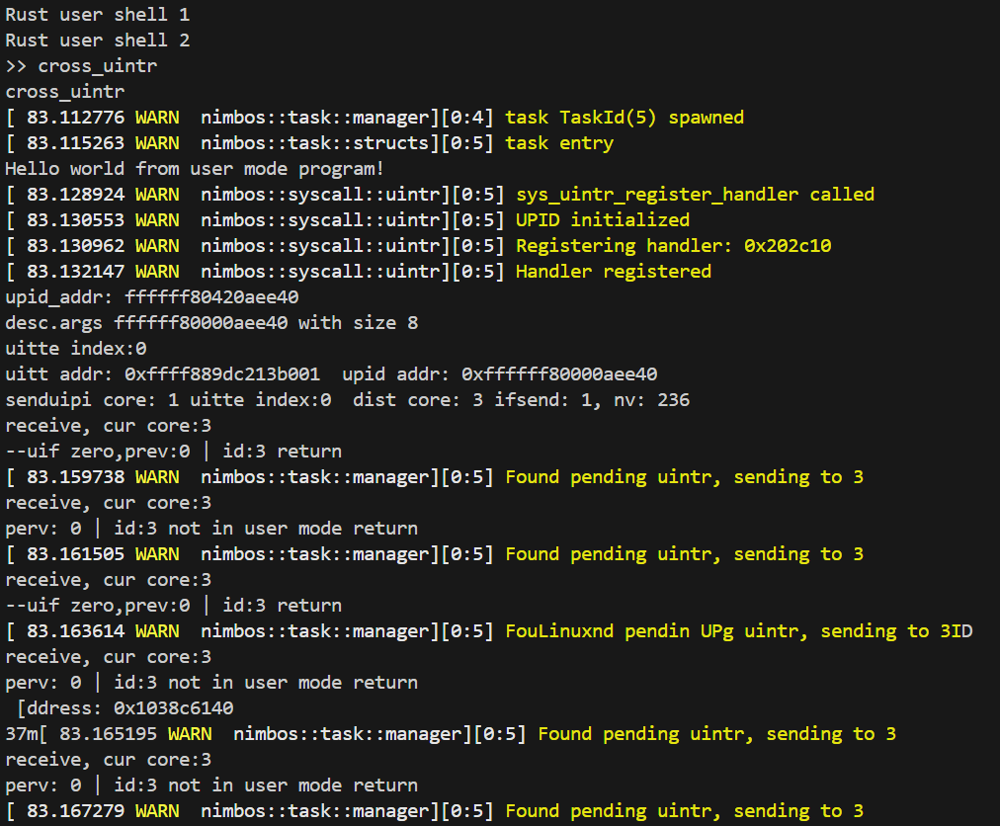
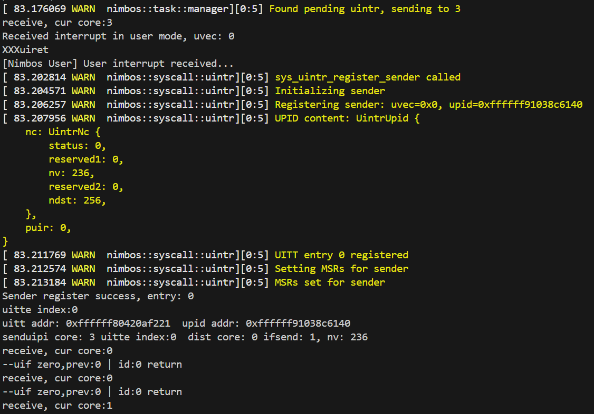
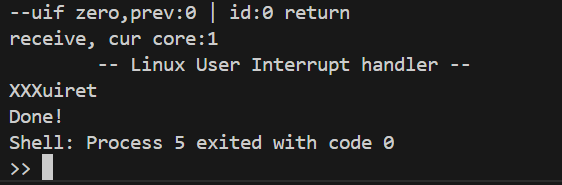

### 第九周工作总结

左晨阳 2022010896

#### 本周工作

基本实现了实现了 Linux 域和 nimbos 域互相收发 uintr。

**Linux 注册 sender 系统调用支持直接传入 UPID 地址**

Linux 的 uintr 模块设计为对用户态程序透明，实现跨域用户态中断必须打破部分隔离。上周已经实现了通过 ioctl 接口获取 UPID 地址。要让 Linux 用户态程序能够以 nimbos 程序为 uintr 目标，还需要允许用户态程序直接面向 UPID 地址注册 sender。

- 原本的系统调用预留了 flags 参数但并未使用，可以使用一个 flag 区分使用 UPID 地址注册还是使用 fd 注册。
- 目前 uvec 也通过 flags 传入，由于 uvec 只有 64 中合法取值，只会使用较少 flag 位。
- 仿照 `do_uintr_register_sender` 实现了 `raw_uintr_register_sender`，执行相同的 UITT 操作，但是不维护 UPID 的引用计数。
- 经检查，这一设计不会对 Linux 现有的资源管理和 uintr 状态维护产生影响。

这引入的隐患是：

- 无法准确维护 UPID 的生命周期，这有可能导致 Linux 通过发送 UPID 间接访问非法内存。在 syscall forwarding 中，Linux shadow 程序不会在 nimbos 程序终止后继续处理 syscall，所以不会出现运行问题。实际上，硬件会在 UPID 地址非法时忽略 senduipi 请求，所以这带来的风险是有限的，有待进一步考察。

```c
if (flags) {
    printk(KERN_WARNING "uintr_register_sender: flags %x\n", flags);
    if ((~flags) & (1<<9)) {
        return -EINVAL;
    }
    flags &= ~(1<<9);
    if ((flags & 0x3f) != flags) {
        return -EINVAL;
    }
    return raw_uintr_register_sender(uintrfd, flags);
}
```

**Linux 向 nimbos 发送 uintr**

由于硬件对 UPID 的访问是经过地址翻译的，因此需要在 Linux 中创建对 nimbos 地址空间的映射。这会导致 RVM1.5 创建的隔离性被部分打破。在 jailhouse 中，仿照对 hypervisor 地址空间的映射，实现了 nimbos 地址空间的映射。

```c
rtos_mem_res =
    request_mem_region(rt_region.start, rt_region.size, "nimbos RTOS");
if (!rtos_mem_res)
{
    pr_err("...");
    goto error_free_mem_regions;
}

/* Map physical memory region reserved for Jailhouse. */
rtos_mem = jailhouse_ioremap(rt_region.start, 0xffffff8000000000UL, rt_region.size);
if (!rtos_mem)
{
    pr_err(
        "jailhouse: Unable to map RAM reserved for rtos at %08lx\n",
        (unsigned long)rt_region.start);
    goto error_release_rt_memreg;
}
```

同样仿照对 hypervisor 资源的管理，让地址和映射在 jailhouse 模块移除时被释放。相应地，在 nimbos-driver 中，不再需要进行地址预留和映射，可以直接加载 nimbos。

待解决的问题：

- 地址只能映射到 0xffffff8000000000UL，而不能映射到 0xffffff8042000000UL，这导致与 nimbos 内的映射不一致。

只需要在使用 nimbos UPID 前，对地址减去偏移量0x42000000，确保硬件能够正确找到相同的物理地址。

**初始化 Cross Uintr 的系统调用**

为 nimbos 增加一个系统调用，实现 nimbos 用户程序和 Linux shadow 程序间交换 UPID 地址。该系统调用虽然功能不典型，但可以直接服用原有 syscall forwarding 的代码，简单地通过 SyscallQueueBuffer 传递。在 shadow 程序中，按如下顺序处理：

1. 调用 uintr_register_sender 注册成为面向 nimbos 的发送者；
2. 发送一个用户中断确认链接；
3. 注册一个 uintr_handler，通过 ioctl 从返回的 fd 中获取 UPID 地址；
4. 通过 SyscallQueueBuffer 返回 UPID 地址给 nimbos 程序。

```c
// 使用 UPID 地址时要减去 offset
uipi_index = uintr_register_sender(desc.args - 0x42000000UL, 1<<9);
if (uipi_index < 0) {
    printf("Sender register error\n");
    push_syscall_response(scf_buf, desc_index, 0);
    break;
}
// printf("UITTE index: %d\n", uipi_index);
_senduipi(uipi_index);
```

问题：

- 有没有比使用固定 offset 0x42000000UL 更好的处理方法？
- *严重* 目前发送概率性成功，待解决。

**nimbos 向 Linux 发送 uintr**

在 nimbos 用户程序通过 sys_init_cross_uintr 获取到 Linux UPID 后，注册成为面向 Linux 的发送者。要实现跨域中断，需要在 nimbos 中简历 Linux 相关地址的映射。目前，直接建立了整个物理地址空间到 0xffff_ff90_0000_0000 的映射。

```rust
ms.insert(MapArea::new_offset(
    VirtAddr::new(0xffff_ff90_0000_0000), 
    PhysAddr::new(0), 
    1<<33, 
    MemFlags::READ
));
```

待修改：

- 使用更佳研究的映射方式，避免直接映射整个物理地址空间。
- 打破隔离有没有其他隐患？

**实验效果**







#### 下周工作计划

- 优先修复错误，确保 nimbos 和 Linux 互相发送 uintr 稳定
- merge
- 如有可能，设计 syscall forwarding 具体流程，实现更多 syscall