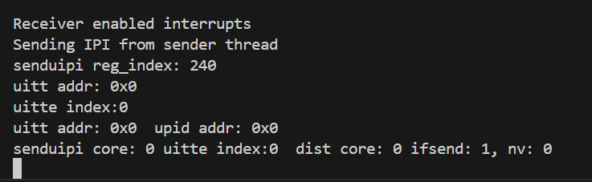
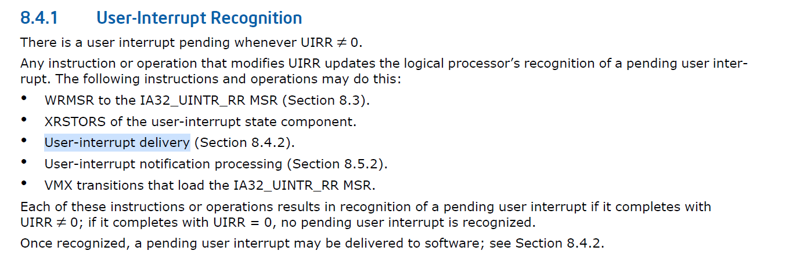
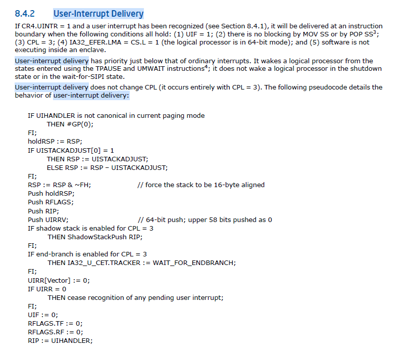

### 第十三周工作总结

左晨阳 2022010896

#### 本周工作总结

- 总结用户态 Syscall Forwarding 中遇到的运行时错误，尝试解决；
- 梳理 qemu-uintr 的实现，发现与 intel 手册不一致的地方；
- 实现结合原内核态 SCF 的转发机制，设计向从 Nimbos 内核向 Linux shadow 程序发送 uintr 通知的机制（冉博涵同学实现了从 Linux 发送普通中断到 Nimbos 内核的通知机制）；

#### 遇到问题及解决方案

**运行时错误及解决**

**1.**

发现在用户态往 nimbos 回发 uintr 时，出现 Segmentation Fault。使用 dmesg 查看日志发现触发 GP 异常，遂检查 qemu 源码发现会在 uitte 编号非法时产生该错误。打开 qmeu 日志，发现 senduipi 指令执行时，所有 MSR 均为 0。

使用 linux kernel 提供的 uipi_sample，发现在经过修改的 linux 上，仅在 Linux 域上发送 uintr 就会触发该错误。错误频率约每 20 次中有 1 次。改用完全未修改过的 linux 内核，发现在该内核上发送 uintr 时错误频率约每 500 次中有 1 次。



回滚代码修改，逐步测试，**发现曾为了方便调试将 pr_debug 修改为 printk，导致错误概率上升**。将其改回 pr_debug 后，错误概率下降到原水平。受到启发，将原本存在的 printk 删除，结果大概率发生接收方无法受到 uintr 的错误。

即使让 Linux 内 uintr 发送出错概率下降，也无法解决与 nimbos 互发 uintr 中出错概率很高的问题。未发生 nimbos 发送给 Linux 的 uintr 出错，推测是 Linux 内对 MSR 的处理不当。

```
其实 qemu 对 GP 的判定也不完整，在 UITT_ADDR 为 0 时应当直接触发 GP。目前只有 UITT_INDEX > UITT_NUM 时才会触发 GP。
```

**2.**

有时目标用户态程序长时间无法收到 uintr，具体分为两种情况，一是 qemu 日志显示 UIF 始终为 0：

```
receive, cur core:2
--uif zero,prev:3 | id:2 return
receive, cur core:2
--uif zero,prev:3 | id:2 return
receive, cur core:0
--uif zero,prev:3 | id:0 return
receive, cur core:2
--uif zero,prev:3 | id:2 return
receive, cur core:0
--uif zero,prev:3 | id:0 return
receive, cur core:2
--uif zero,prev:3 | id:2 return
receive, cur core:0
--uif zero,prev:3 | id:0 return
receive, cur core:2
--uif zero,prev:3 | id:2 return
receive, cur core:2
--uif zero,prev:3 | id:2 return
```

二是 qemu 判定 upid.puir 为 0，所以不进入 handler：

```
receive, cur core:3
do not go to handler
receive, cur core:3
do not go to handler
receive, cur core:3
do not go to handler
receive, cur core:3
do not go to handler
receive, cur core:3
do not go to handler
receive, cur core:3
do not go to handler
receive, cur core:3
do not go to handler
receive, cur core:3
do not go to handler
receive, cur core:3
do not go to handler
```

有时候多等待一会，就能收到 uintr。但如果删除 kenel 中的 printk，等待很久（数分钟）也无法收到 uintr。

```
发现如果长期未收到 uintr，手动杀掉程序，再运行时会出现没等发送就收到的情况。检查发现之前实现的简易内存分配忘记分配时清零，已经修复。
```

**3.**

另一种错误情况是 qemu 内已经执行了进入 handler 的代码，并且地址正确，但是 handler 函数未被执行：


如果使用 gdb 调试在 handler 函数打断点，则会发生 Aborted (core dumped) 错误，无法调试。这一错误在跨域 uintr 和域内 uintr 均出现。

**qemu-uintr 的一个实现错误**

目前向同一个用户程序连续发送两个vector不同的uipi，只会收到一次。原因是 qemu 中，helper_rrnzero 只会在 do_interrupt64（收到中断）和 helper_wrmsr（修改 MSR）中被调用，而一次用户通知过程中，只会清零 uirr 中的一位。也就是说 uirr 可能保持一个非零状态而不通知用户程序。根据intel的手册，uirr 没有清零的时候，应当重复通知用户程序。





**错误总结**

上述错误与本实验的设计没有直接联系，疑似由 qemu 和 linux kernel patch 复合引起的，尝试修复花费大量时间无果。由于最终希望在物理机上实现，听取学长建议，暂时忽略这些错误。

#### 基于 uintr 的转发方案

上周实现了用户态的 uintr syscall 转发，本周实现了内核态的转发。对于一个 SCF 实例，额外记录它是否被初始化，以及 uitte 编号：

```rust
// #[derive(Copy, Clone)]
pub struct SCF {
    pub slot_num: usize,
    pub initialized: bool,
    pub uitte: isize,
}
```

第一次需要通知 linux shadow 程序时，向队列中压入一个对 linux 侧 UPID 的请求，然后发送一个 irq。之后基于获取到的 UPID 注册成为发送者，每次需要通知时改用 uintr。

```rust
#[cfg(feature = "uintr")]
pub fn init_uintr_scf(&mut self) {
    let cond = SyscallCondVar::new();
    while !self.queue().send(
        ScfOpcode::UintrInit,
        [0, 0, 0, 0],
        ScfRequestToken::from(&cond),
    ) {
        CurrentTask::get().yield_now();
    }
    super::notify(self.irq_num());
    let upid_addr = cond.wait() + UPID_MEM_OFFSET as u64;
    self.uitte = sys_uintr_register_sender(upid_addr, 0);
    self.initialized = self.uitte >= 0;
}

fn notify(&mut self) {
    #[cfg(feature = "uintr")]
    {
        if !self.initialized {
            self.init_uintr_scf();
        } else {
            unsafe {senduipi(self.uitte.try_into().unwrap())};
        }
    }
    #[cfg(not(feature = "uintr"))]
    {
        super::notify(self.irq_num());
    }
}

fn send_request(&mut self, opcode: ScfOpcode, args: [u64; 4], token: ScfRequestToken) {
    while !self.queue().send(opcode, args, token) {
        CurrentTask::get().yield_now();
    }
    self.notify();
}
```

同时，shadow 程序将原 poll request 包装为 handler。