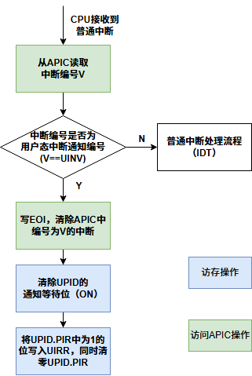

### 第十五周工作总结

左晨阳 2022010896

#### 本周工作总结

1. 使用 uintr 机制实现从 Linux 用户程序到 Nimbos 内核的反向通知；
2. 实现 SCF 在 clone 时的正确处理，修正锁的使用；
3. 进行实机实验；

#### 下一周计划

完成报告文档及 slides，汇报展示。

#### 工作说明

**1. uintr 反向通知**

在 UPID 中可以填写 IPI 通知向量，当向量值为 0xec，即 uintr 通知向量时，目标核会做用户态中断处理并调用 uintr handler，而当向量为其他值时，硬件会进入常规中断处理并调用中断 handler。



要实现从 Linux 用户程序到 Nimbos 内核的直接通知，可以手动约定一个通知向量，而不使用 uintr 接收机制。此时，不需要由 nimbos 实际向 shadow 程序提供 UPID 地址，shadow 程序可以内置一个常量 UPID：

```c
static struct uintr_upid nimbos_upid = {
    .nc.nv = 41,     // Notification vector
    .nc.ndst = (3<<8),   // Notification destination
};
```

由于在 signal handler 中无法使用 xsave/xrstor，因此需要在 signal handler 之外进行 uintr sender 的注册。可以与 nimbos_setup_syscall_buffers 同步进行注册。当 shadow 程序初次启动时，可以直接注册 uintr sender，当 shadow 程序 fork 时，子进程可以直接在 uintr handler 执行过程中重新注册。

在 nimbos 中，只需要为通知向量注册 handler 即可。

```rust
crate::drivers::interrupt::register_handler(APIC_LINUX_IPI_VECTOR2, ||  {
    handle_irq();
    IrqHandlerResult::Reschedule
});
```

需要注意：

- 目前，在每个进程第一次进行系统调用转发时，由于 nimbos 端不清楚 shadow 程序的 UPID 地址，会使用常规方法发送 IPI 进行通知。此时，shadow 程序会进入 signal handler，也就因 MSR 状态丢失而失去了 uintr 通知的能力。因此，这种情况下需要使用 Linux 系统调用的方式发送 IPI。
- 从标准输入读取时，shadow 程序会创建一个线程来读取输入，此时如果要使用 uintr 通知，需要在该线程中注册 uintr handler。但这样得不偿失，因此仍然使用 Linux 系统调用的方式发送 IPI。

**2. SCF 在 clone 时的处理**

shadow 程序不会对线程创建进行特殊处理，nimbos 中的不同线程会共享同一个 SCF buffer。因此，在 clone 时需要增加 SCF 实例的引用计数，并在线程退出时减少引用计数。只有当引用计数为 0 时，才会释放重置 SCF 资源的状态。

问题与解决：原本的实现中，task 在访问 SCF 时会加锁。但在锁等待时，会禁用 irq 导致无法接收系统调用响应通知，导致死锁发生。因此，修改为在等待响应时不加锁，只在内存读写操作中加锁。同时，将 SCF buffer 初始化情况和 uitte 记录到 task context 中，避免在 SCF 实例中存储可变状态，而使用原子操作进行引用计数的增加和减少。这样，多个线程可以同时访问同一个 SCF buffer。

**3. 实机实验**

