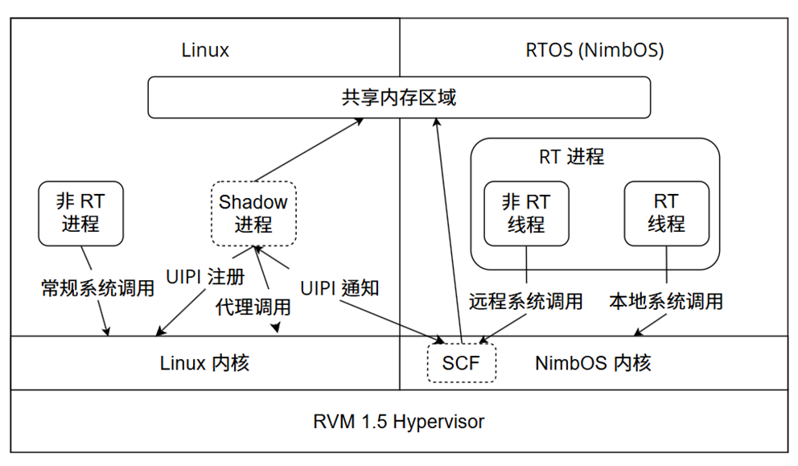
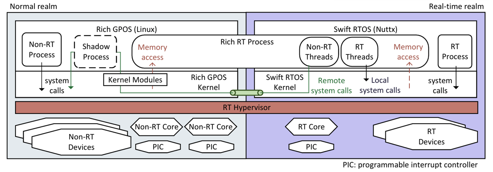
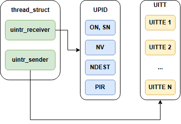
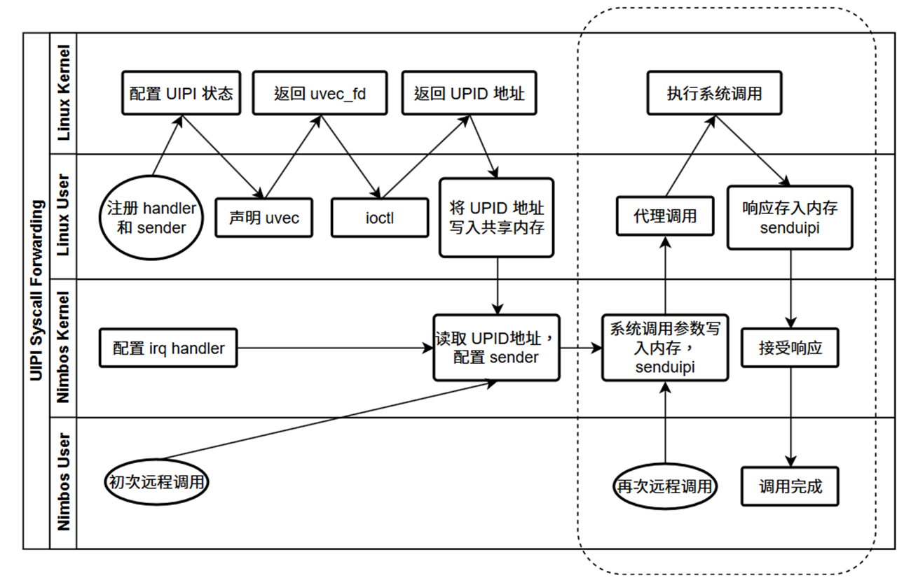
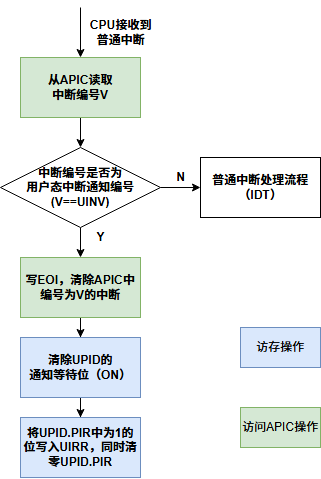
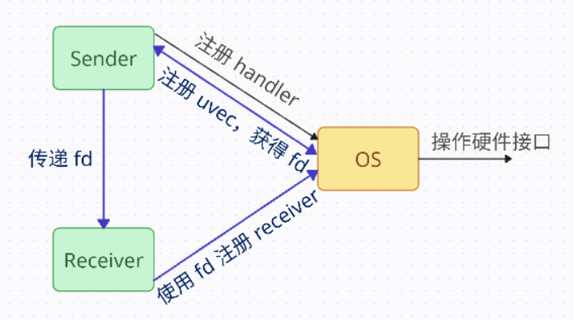
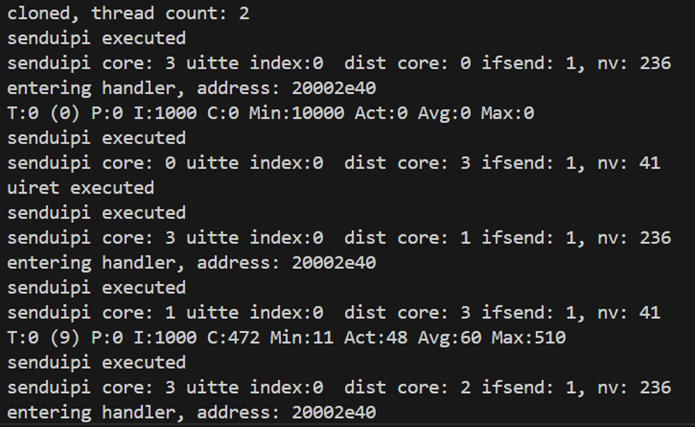
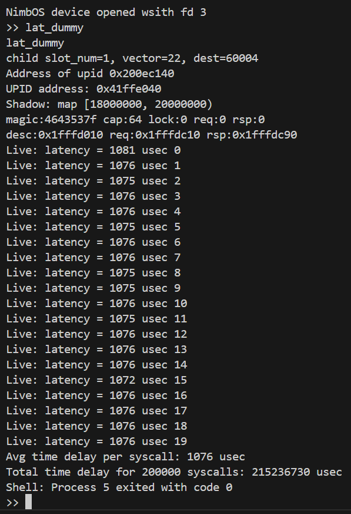

## 基于用户态中断的复合实时操作系统设计 大实验报告

左晨阳 计28-经22 2022010896 合作：冉博涵



**概要**

复合实时操作系统（cRTOS）通过在分区 hypervisor 上创建两个域，一个 Linux 正常域和一个 RTOS 实时域，实现硬实时性能和 Linux 丰富功能的兼得。其中，运行在实时域的进程可以通过远程系统调用利用 Linux 的丰富特性。本实验基于 Intel 用户态中断（UIPI）机制，设计并实现了远程系统调用的高效通知机制，消除了发送普通中断通知（IPI）的特权级切换开销，并从理论上说明了该机制的有效性。

本实验在 RVM1.5 上运行 Linux 和 NimbOS，并为 QEMU 模拟器完善了用户态中断的支持，借助 QEMU 验证了实现的可行性。基于此，我们进一步将设计迁移到实机（Intel Xeon 6710E 处理器）上进行验证，初步结果表明本设计有效。本实验的主要意义在于：

1）为 cRTOS 的设计提供了一个高效的远程系统调用通知机制，消除了特权级切换开销；
2）为用户态中断的应用提供了一个新的思路，展示了其在 cRTOS 中的应用潜力。

### 1 背景与意义

#### 1.1 复合实时操作系统（cRTOS）



随着物联网、边缘计算以及工业控制等应用的快速发展，嵌入式系统对 OS 提出了更高的双重要求：一方面需要硬实时性能以确保关键任务在严格时间约束下完成；另一方面，越来越多的应用也希望引入通用操作系统（如 Linux）所具备的丰富功能，如图形界面、网络通信等。这种对实时性与功能性的双重需求，使得传统的轻量 RTOS 显得力不从心，而直接修改 Linux 以提升其实时能力则往往面临兼容性差、维护成本高的问题。cRTOS 的设计为解决这一问题提供了新思路，它采用分区型虚拟化架构，将系统划分为两个隔离的运行域：普通域运行未经修改的 Linux，而实时域运行一个轻量的 RTOS。其中实时进程在 RTOS 中运行，而通过影子进程（shadow process）机制，这些进程能够借助共享内存在用户空间发起远程系统调用，访问 Linux 的上层功能。

尽管 cRTOS 在架构设计上证明了 Linux 和 RTOS 协同工作的可能性，其远程系统调用机制却也带来了性能上的显著瓶颈。远程调用需要在实时域和普通域之间频繁进行上下文切换和中断通知（IPI），这一链路包含多个阶段：从实时线程陷入内核态、请求排队、Linux 侧处理，再到返回与唤醒线程，每一步都存在非确定性的调度开销。实验表明，典型的远程系统调用如 read() 和 write() 的最大延迟在 27 微秒以上，这与 PREEMPT_RT native Linux 中 0.4 和 0.3 微秒的延迟形成鲜明对比。因此，如果能实现一种高效的远程系统调用通知机制，以消除部分冗余特权级切换的开销，可以提升 cRTOS 的整体性能。

#### 1.2 用户态中断（UIPI）

UIPI 是 Intel 在 Sapphire Rapids 处理器中引入的一种硬件级快速通信机制，它允许用户空间程序直接收发中断，而无需经过内核介入。与 Linux 中传统的 signal 机制相比，UIPI 避免了多次特权级切换的开销。若要使用 UIPI，用户线程仍然需要先向内核注册发送方和接收方身份，从而在高效通信的同时维护系统隔离性与整体安全。其硬件接口通过内存结构体和一组新增的模型特定寄存器（MSR）实现，一般由内核管理。作为一种内核绕过技术，UIPI 为构建高性能用户态调度器提供了基础，可使线程间的事件通知和调度更加高效。

UPID（User Posted Interrupt Descriptor）和 UITT（User Interrupt Target Table）是 UIPI 机制中的两个核心数据结构，分别用于描述中断的接收者（receiver）和发送者（sender）信息。UPID 由接收线程所在用户空间维护，包含 handler 地址、通知触发状态、IPI 向量等字段，用于接收和响应来自用户态的中断通知。而 UITT 则由发送方线程使用，用于指定用户通知向量和查找目标线程的 UPID 地址，实现中断的定向发送。整体上，这两个结构构成了一套高效的用户态中断通路，通过在用户空间完成中断的投递和响应，绕过内核参与，从而显著降低通信延迟和调度开销。



UIPI 的引入对高性能计算和用户态操作系统设计具有重要意义。它为用户态调度器提供了一种高效的通信机制，已有设计利用 UIPI 绕过内核路径带来的延迟，在用户空间实现更低延迟、更高频度的事件响应与抢占控制。这不仅提升了线程调度的响应速度，也使得更加激进的抢占式调度策略成为可能。

#### 1.3 设计目标

本实验的核心目标是利用 UIPI 优化 cRTOS 中远程系统调用的通知机制，从而减少传统 IPI 带来的特权级切换开销。具体而言，当 NimbOS 进程需要通过 Linux 执行系统调用时，NimbOS 内核直接通过 UIPI 通知 Linux 侧的 shadow 进程，由其代理执行系统调用；完成后，shadow 进程再通过 UIPI 通知 NimbOS 内核唤醒等待的实时线程。

传统的远程系统调用机制中，当 NimbOS 内核需要请求 Linux 执行系统调用时，会触发 IPI 中断，迫使 Linux 进入内核态处理中断，随后再通过信号（signal）机制唤醒目标 shadow 进程。这一路径涉及两次特权级切换，并受 Linux 调度器非确定性的影响，使得整体延迟较高。而采用 UIPI 后，NimbOS 内核可直接向 Linux 的影子进程发送中断，无需陷入内核，从而大幅缩短通知延迟。同样地，在系统调用完成后的响应阶段，传统方式要求影子进程通过 Linux 系统调用触发 IPI 通知 NimbOS 内核，这又涉及一次特权级切换和内核处理。而 UIPI 机制允许影子进程在用户态直接向 NimbOS 内核发送中断，仅需在初始阶段注册 UIPI 相关配置（如 UPID 和 UITT），后续通信完全在用户态完成。这不仅减少了系统调用的上下文切换开销，还避免了 Linux 内核调度带来的不确定性，使得整个远程调用链路的延迟更可控，更符合实时系统的需求。

### 2 实验设计

#### 2.1 实验环境

本实验选择 RVM 1.5 作为 hypervisor，这是一种 type-1.5 hypervisor，以 Linux 作为宿主操作系统，需要使用修改自 Jailhouse 的驱动程序来加载。在 RVM 1.5 之上，我们运行 NimbOS 作为实时域的 RTOS，并在普通域运行 Linux。NimbOS 是一个高度简化的 RTOS，其内核仅包含最基本的任务调度和内存管理功能。由于 Linux 主分支尚未支持 UIPI，因此我们使用了 Intel 发布的相关补丁。

在实验前期主要过程中，本实验未取得实机支持，因此在 QEMU 模拟器上进行开发和测试。我们在往届同学的基础上，完善了 QEMU 对 UIPI 的支持，使其能够模拟用户态中断的发送和接收。QEMU 模拟器的使用使得实验过程更为灵活，便于调试和验证设计思路。实验的最后一周，我们在实机上进行了验证，使用 Intel Xeon 6710E 处理器，并成功实现了基于 UIPI 的远程系统调用通知机制。

#### 2.2 基于 UIPI 的通知机制设计

为了能够在 NimbOS 中直接运行为 Linux 编译的用户程序，我们希望在 cRTOS 中保持实时域系统调用语义与 Linux 完全一致。当需要进行远程系统调用时，不是由实时进程直接与 shadow 进程交互，而是由 NimbOS 内核和 shadow 程序互相发送 UIPI 通知。具体来说，本实验对通知机制的设计包含两个部分，从 NimbOS 内核到 shadow 程序的正向通知，以及从 shadow 程序到 NimbOS 内核的反向通知。



为了将这一通知机制与基线方案进行对比，我们首先实现了一个基线方案，该方案与实验设计的通知机制在逻辑上完全一致，但使用传统的 IPI 机制进行通知。基线方案中，NimbOS 内核通过 IPI 通知 Linux 侧的 shadow 程序执行系统调用，shadow 程序完成后再通过 IPI 通知 NimbOS 内核唤醒等待的实时线程。

**正向通知**

为实现正向通知，当 Linux 侧的 Shadow 进程被创建时，它会首先向内核注册成为 UIPI receiver。内核将接收它传入的 handler 地址作为参数，并为它初始化 UPID。随后，Shadow 进程将 UPID 的地址写入与 NimbOS 共享的内存区域，使得实时域的进程能够获取该信息。这一注册过程在每个 Shadow 进程初始化时都需要执行，以确保其能正确接收来自 NimbOS 的用户态中断。

当 NimbOS 的进程需要第一次发起远程系统调用时，会先从共享内存中读取目标 Shadow 进程的 UPID 地址，并维护硬件接口注册自身为 UIPI sender，关联对应的 UITT 条目。注册完成后，NimbOS 进程在需要通知 Shadow 时代直接执行 senduipi 指令发送用户态中断。由于将接收过程可以在用户态完成，避免了陷入内核、信号传递等额外开销，使得跨域通信的延迟显著降低。shadow 程序的 handler 会检查共享内存中待处理的系统调用请求，并执行相应的系统调用。完成后，shadow 程序会将结果写回共享内存。

**反向通知**



UIPI 机制中，在 UPID 中可以填写 IPI 通知向量，当向量值为 0xec，即 UIPI 专有通知向量时，目标处理器会按用户态中断流程处理并调用用户 handler；而当向量为其他值时，硬件会进入常规中断处理并调用内核中断 handler。借助这一机制，可以实现从 Shadow 程序到 NimbOS 内核的反向通知。Shadow 进程在初始化阶段需要创建一个以实时域处理器为通知目标的固定 UPID 结构体，并向内核注册为 UIPI sender，其 IPI 向量为非 0xec 的固定值。

当 Shadow 程序完成系统调用后，立即执行 senduipi 指令。NimbOS 内核只需要提前注册相应的 IRQ handler，并在 handler 中检查共享内存中待处理的系统调用响应，通过 Condvar 唤醒等待的实施线程。

### 3 实验实现

#### 3.1 QEMU 模拟器支持 UIPI

往届同学已经实现了 QEMU 模拟器对 UIPI 的部分支持，但在实验过程中发现其存在一些问题，本实验对其中大部分问题进行了修复。

**TESTUI 指令**

本实验增加了 QEMU 对 TESTUI 指令的支持。该指令用于测试 UIF（User Interrupt Flag）是否被设置。NimbOS 内核在保存和恢复线程上下文时，需要使用 TESTUI 指令来检查 UIF 的状态。具体来说，该指令将 EFLAGS 中的 CF 设置为 UIF 的值，并将其他位清零。本实验在 QEMU 中增加对该指令的解析和模拟。

**SENDUIPI 指令的执行校验**

根据 Intel 规范，存在一些 SENDUIPI 指令执行时硬件会进行的校验：

- 检查保存 UITT Address 的 IA32_UINTR_TT 寄存器中最低位是否为 1。如果最低位为 0，则表示 UITT Address 无效，应触发 GP 异常。
- 检查 UITTE （User Interrupt Target Table Entry）是否有效。如果其中 UPID 地址没有按照 64 字节对齐，应触发 GP 异常。
- 如果寄存器中 SENDUIPI 参数大于 IA32_UINTR_MISC 寄存器中 UITT Size 的值，则应触发 GP 异常。
- UPID 和 UITT 中非法的字段值应触发 GP 异常。

本实验在 QEMU 中增加了对这些校验的支持，以便开发者能够在模拟器中验证对 UIPI 的实现是否符合规范。

**XSAVE 对 UIPI 状态的支持**

UIPI 相关 MSR 寄存器和 UIF 应当被 XSAVE/XRSTOR 保存和恢复，Linux 依赖这一机制正确维护线程的 UIPI 上下文。本实验在 QEMU 中增加了 XSAVE/XRSTOR 对 UIPI 状态的支持，使得安装有 UIPI 补丁的 Linux 能够在模拟器中正常运行。

#### 3.2 Linux 内核对跨域 UIPI 的支持

**UPID 地址暴露**



在 Linux 中，UIPI 的全部硬件接口操作由内核完成，对用户进程透明。当用户程序注册成为 UIPI receiver 后，并不会获得对于自身 UPID 的读写权限，也不能够获取 UPID 的物理地址。相反，它只能注册它希望接收的用户中断向量号（uvec），并获得内核封装后的文件描述符 uvec_fd。用户程序可以将该文件描述符传递给发送方，使其能够向内核注册成为该 UPID 对应 uvec 的 sender。这一设计主要是处于安全考虑，防止用户任意发送 IPI 中断，干扰其他程序甚至内核的正常运行。

要让 NimbOS 具备向 shadow 程序发送 UIPI 的能力，需要将 shadow 程序的 UPID 地址暴露给 NimbOS。为此，本实验在 Linux 内核中为 uvec_fd 增加了一个 ioctl 接口，允许用户程序获取 shadow 程序的 UPID 物理地址。这一设计在安全性上具有改进空间。

**内存访问权限**

SENDUIPI 指令的执行涉及对目标 UPID 结构体的内存访问，这一访问发生在内核态权限下。因此，NimbOS 内核需要确保在发送 UIPI 时，能够正确访问 shadow 程序的 UPID 结构体。通过将 Linux 内核地址空间完全暴露给 NimbOS，可以实现这一目的，然而会造成不必要的安全隐患。为此，本实验采用了专门的物理内存隔离方案：在系统初始化阶段，预先划定一个独立的 4KB 物理页专门用于 UPID 的分配，并通过为 Linux 内核新增专用内存分配器来管理该区域。在 NimbOS 启动时，也需要创建一个对应的虚拟地址映射，以便能够访问 shadow 程序的 UPID 结构体。

实际上，本实验也在 NimbOS 侧进行了对称的修改，使得 Linux 用户程序可以直接向 NimbOS 发送 UIPI。这一设计使得 NimbOS 能够与 Linux 互为 sender 和 receiver，从而实现双向通信。

**UIPI Sender 开放注册**

为了让 Shadow 程序能够向 NimbOS 发送 UIPI，必须允许用户程序通过给定 UPID 地址注册成为 sender，而不仅限于面向 uvec_fd 进行注册。为此，本实验通过在原本的系统调用中自定义 flag 标签，开放了新的注册模式。这样，Shadow 程序可以直接提供预填写的 UPID 的地址，实现向 NimbOS 内核发送 UIPI，而无需依赖 uvec_fd。值得注意的是，shadow 程序填写的 UPID 中并不需要实际包含有效的 handler 地址，只需要填写目标处理器 APIC ID 和事先约定的 IPI vector，就可以使接受方进入常规中断处理流程。NimbOS 不必为此配置 MSR 和 UIF，只要注册 IRQ handler 就能捕获对应通知。

**Linux kernel 修改总结**

相比于 cRTOS 完全不修改 Linux 内核的设计，本实验对 Linux 内核进行了少量但必要的修改，以支持跨域 UIPI 的发送。这些修改增加了系统的灵活性，但也带来了一定的安全隐患。

#### 3.3 NimbOS 对 UIPI 的支持

**系统调用**

本实验仿照 Intel 编写的 Linux uintr patch，为 NimbOS 内核添加了简化的 UIPI 相关系统调用，包括 sender 和 receiver 的注册。注册 receiver 时，需要传入 handler 地址，并返回 UPID 的物理地址。注册 sender 时，传入 UPID 地址和 uvec，并返回 UITTE 序号。用户程序直接使用 UITTE 序号来发送 UIPI。添加了相关系统调用后，NimbOS 用户程序能够互相发送 UIPI 通知。

**上下文切换**

上下文切换时，NimbOS 内核需要保存和恢复与 UIPI 相关的状态，这包括相关 MSR 寄存器和 UIF 的值。具体来说，在 task 上下文结构中增加相关字段，进入和退出上下文时，将 MSR 的值压入或弹出栈。其中，UIF 的值需要通过 TESTUI 指令来获取，并在恢复时使用 STUI 置 1 或 CLUI 指令置 0。

**二次通知**

若面向某进程的 UIPI 到达，而此时该进程未在运行状态，则 UPID 中的 PUIR（Posted User Interrupt Requests）对应位会被设置为 1，表示有未完成处理的通知。因此，操作系统在重新调度该进程时，需要检查 PUIR 是否全为 0。如果不全为 0，则需要重新通过 APIC 发送以 0xec 为向量的 IPI 通知，以确保该进程 handler 能够正确被调用。

#### 3.4 NimbOS 对系统调用的处理

**需要转发的系统调用**

本实验参考 cRTOS 的实现，将系统调用分为三类处理：

- 实时系统调用：与调度和同步相关，直接在实时域中进行处理。例如 nanosleep()、gettime() 等时钟相关调用，或是实时 I/O 设备的访问操作。
- 远程系统调用：需要在正常域，也就是 Linux 域执行的系统调用。例如交互 I/O 操作、正常域中的文件操作、与非实时进程的 IPC 相关调用。
- 双端系统调用：需要在 Linux 和 nimbos 中同步处理的系统调用。为使系统调用中 Linux 可以访问用户数据，需要保持 shadow 进程与实时进程内存布局一致，mmap()、munmap() 等系统调用需要同步处理。而由于 shadow 进程总要与实时进程一一对应，并且每一对进程都需要共享一个 syscall forwarding buffer（SCF buffer），因此必须同时在两个域执行进程的创建和销毁，exit()、fork() 等系统调用需要 shadow 进程同步执行。加载 ELF 可执行文件时，也需要将内存映射到 shadow 进程中。

这三类系统调用中，远程系统调用和双端系统调用需要通过 UIPI 通知进行转发。

**系统调用转发**

按照设计，当第一个实时进程被创建时，会使用事先约定的物理内存区域作为 SCF buffer，并将其映射到 shadow 进程的地址空间中。这样，shadow 进程就可以直接访问该内存区域，从而实现与实时进程的共享。当后续进程被创建时，父进程 fork() 调用作为一个双端系统调用，其从 shadow 进程获得的响应会包含新 SCF buffer 的地址，双方子进程可以使用该地址进行共享。

当新的线程被创建时，shadow 进程不会执行特殊操作，只会记录线程数的变化。只有当线程数回归 0 时，才会释放 SCF buffer 的资源。这样，多个线程可以共享同一个 SCF buffer，避免了不必要的内存分配和释放开销。SCF buffer 使用锁机制实现跨域的同步访问，确保在多线程环境下的安全性。只有当读写 SCF buffer 时，才会加锁，而在等待系统调用响应时不会加锁。这样，不同实时线程可以同时用一个 SCF buffer 进行系统调用转发，而不会发生阻塞。

由于 UIPI 状态是逐线程的，对于每一个实时线程，NimbOS 都要为它注册 UIPI sender。

#### 3.5 Shadow 程序

**UIPI 相关配置**

当第一个 shadow 程序启动时，其会立即注册成为 UIPI sender 和 receiver。注册时，shadow 程序会将自身的 UPID 地址写入共享内存区域，以便 NimbOS 内核能够获取该信息。此外，当通过 fork() 创建子进程时，子进程会立即分配新的 SCF buffer，同时立即完成 UIPI 相关注册。

每次发送反向通知前，shadow 程序需要清空 UPID 中的 ON（Outstanding Notification）位。这是因为当 UPID 中的 ON 位为 1 时，表示有未完成的通知，硬件不会重复发送 IPI。因此，shadow 程序在发送 UIPI 前需要确保 ON 位为 0，以便能够正确触发 NimbOS 内核的 handler。

**用户程序的加载**

如前所述，加载 ELF 时，需要在 shadow 程序中同步内存映射。由于此时线程尚未完成创建，不宜在 NimbOS 中为其注册 UIPI sender。本实验此时会采用轮询法，在 NimbOS 和 Shadow 进程中都不断检查共享内存区域中来自对方的修改，从而实现同步。

### 4 实验结果

#### 4.1 QEMU 模拟器验证

本实验在 QEMU 模拟器上进行了初步验证，确保了 NimbOS 中 UIPI 相关的系统调用和上下文切换能够正确工作，并进一步验证了跨域 UIPI 的发送和接收机制。经检验，能够在 NimbOS 中正常进行线程、子进程创建，同时保持良好的系统调用转发效果。



上图中，UIPI 相关日志由 QEMU 打印。可以发现，一次系统调用转发需要两次 UIPI 通知，第一次 IPI 向量为 236，即 0xec，为 NimbOS 向 shadow 程序发送通知，会进入 shadow 程序的 UIPI handler，并最终通过 uiret 退出 handler；第二次 IPI 向量为 41，为 shadow 程序向 NimbOS 发送通知，不会进入 UIPI 接收处理阶段，而是直接进入 NimbOS 的 IRQ handler。

在这样一个简化版本的 cyclictest 中，clone 创建子进程导致线程计数增加至 2。子进程反复调用 nanosleep()，模拟实施任务的执行。由于 nanosleep() 是一个实时系统调用，因此会直接在 NimbOS 中处理，不需要转发到 shadow 程序。而主线程则会向 Linux 侧的控制台打印日志信息，会用到远程系统调用 write()，因此需要转发到 shadow 程序。

#### 4.2 实机验证

实验的最后两周中，我们在 Intel Xeon 6710E 处理器的实机上对设计进行了验证。经检验，大部分主要设计工作正常，但存在以下问题需要修复：

- 在初始设计中，shadow 程序的 UPID 被定义为进程内的静态变量，但由于 SENDUIPI 指令的内存访问操作在内核权限下执行，直接读写用户态变量会触发内存保护异常。我们使用的解决方案是将 UPID 移至 NimbOS 内核管理，每次接收到 UIPI 后，需要由 NimbOS 主动清空 UPID 的 ON 字段，否则硬件会认为中断仍在处理，从而抑制后续 IPI。
- 用于对比的基线做法中，shadow 程序虽然能通过 irq_request() 成功注册 IRQ 号，但 NimbOS 无法据此正确构造 IPI 请求。具体来说，当 NimbOS 尝试通过 IOAPIC PRT（Programmable Redirection Table）读取中断向量和目标 APIC ID 时，由于 RTE（Redirection Table Entry）的语义变化，原实现无法正确解析目标信息。修复方法是，irq_request() 执行后通过 irq_to_desc_sym() 和 irqd_cfg() 内核函数获取 Linux 为 IRQ 号分配的 IPI 向量和目标 APIC ID，再经由共享内存传递给 NimbOS，从而避免直接读取 IOAPIC PRT。



我们编写了一个测试程序对远程系统调用的耗时进行测量，反复调用 10000 次 write() 系统调用，每次打印一个空字符。此外，为了排除 Linux 侧系统调用时间开销，从而仅对比两种方案在系统调用转发中的开销，我们还编写了 dummy() 系统调用，shadow 程序对该调用会直接返回 0 作为结果。同样反复调用 10000 次 dummy() 记录耗时。使用 UIPI 的转发通知机制与基线方案的对比结果如下：

| 方案 | write() 平均耗时（微秒） | dummy() 平均耗时（微秒） |
| --- | --- | --- |
| 基线方案 | 1346 | 1076 |
| UIPI 方案 | 1346 | 1076 |

结果表明，在实机上，UIPI 方案与基线方案中系统调用转发的耗时相差很小，本实验提出的机制尽管减少了特权级切换，但由于共享内存访问、上下文切换等其他因素仍然存在，在实际性能上并未取得显著提升。这很可能意味着通知机制本身在系统调用转发中时间开销占比很小，不是主要的性能瓶颈。未来可以更加精细地测量系统调用转发的各个阶段耗时，特别是通知中断发送本身的耗时，以便更好地评估 UIPI 机制的实际效果。

当然这并非意味着 UIPI 机制没有价值，如果能够将其他因素的开销进一步降低，UIPI 机制仍然有望在更复杂的系统调用转发中展现出更明显的优势。

### 5 总结与展望

**实验总结**

本实验设计并实现了基于用户态中断的复合实时操作系统远程系统调用通知机制，消除了传统 IPI 带来的额外特权级切换开销。通过在 QEMU 模拟器和实机上验证，发现该机制虽然性能优势不明显，但具备充分可行性。实验过程中，我们完善了 QEMU 对 UIPI 的支持，并对 Linux 内核和 NimbOS 进行了必要的修改，以实现跨域 UIPI 通知。

**其他问题与改进**

- NimbOS 加载用户程序 ELF 时，需要与 shadow 进程同步内存布局信息，但由于此时任务尚未完全创建，无法直接通过 UIPI 机制进行高效通知。当前方案依赖共享内存轮询，导致同步延迟较高，处理器占用过高。更优的改进方向是设计一种临时通知机制，例如暂时修改 MSR 中的 UIPI 配置，使该阶段短暂获得发送 UIPI 的能力，从而通过 SENDUIPI 指令触发中断，避免轮询开销。
- 目前 NimbOS 对 Linux 系统调用的支持尚不完善，缺乏文件系统、精细线程管理等关键功能，导致大多数标准 Linux 程序无法直接运行。即使借助 UIPI 实现系统调用转发，仍难以提供完整的 POSIX 兼容环境。未来计划将基于 UIPI 的低延迟系统调用转发机制移植到更为完备的 RTOS，实现真正可用的 cRTOS 环境。
- 目前的实现将 Linux 侧 UIPI 状态管理权限部分下放至用户程序，导致用户可以任意发送 IPI/UIPI，存在严重安全风险。若放弃 Linux 直接向 NimbOS 用户程序发送 UIPI 的功能，仅允许用户态向特定实时域 CPU 发送固定中断向量的 IPI，则可通过约束系统调用自由度缓解该问题，但会牺牲灵活性。更彻底的解决方案是由上层的 RVM 1.5 统一管理 UPID 资源，这需要对 Linux 内核进行深度修改。此外，直接暴露 UPID 地址给用户程序会泄露内核信息并增加系统脆弱性，因此更安全的做法是通过 hypervisor 将 UPID 地址直接传递给 NimbOS 内核，完全绕过用户程序，或由 RVM 1.5 直接接管 UPID 分配和释放，从而在保持高性能的同时确保隔离性。总体来说，安全的 UIPI 内和管理应当与 Linux uintr patch 保持一致，用适当的封装来限制用户接触到实际硬件接口。

**UIPI 应用展望**

UIPI 具有一定的局限性，其中断处理延迟约为 720 个周期，显著高于共享内存轮询的约 100 个周期，性能差距达 6 至 9 倍，且随着处理器预测窗口的增大，流水线冲刷带来的性能损耗将进一步扩大；此外，UIPI 功能较为单一，仅支持核心间中断，不支持设备中断和定时器中断，这限制了其在 I/O 和调度等场景中的应用。然而，UIPI 在进一步拓展应用方面仍具潜力，有望推动更多原本依赖内核特权操作的功能下放到用户态执行，从而简化内核负担、降低系统调用开销，并增强系统的可定制性与实时性。例如，UIPI 可用于实现进程在实时域与通用域之间的快速动态切换，以满足高实时性需求的场景；同时，结合用户态调度器的机制，有望实现近似于 cRTOS 的调度能力，为构建轻量级、高性能的用户态运行时系统提供技术支撑。这些探索有望在嵌入式系统、边缘计算乃至高性能计算等领域发挥重要作用。

### 参考文献与资料

**参考文献**

[1] Yang C.-F., Shinjo Y. Obtaining hard real-time performance and rich Linux features in a compounded real-time operating system by a partitioning hypervisor[A/OL]. Proceedings of the 16th ACM SIGPLAN/SIGOPS International Conference on Virtual Execution Environments[C]. New York, NY, USA: Association for Computing Machinery, 2020: 59–72
[2] Aydogmus B., Guo L., Zuberi D., et al. Extended User Interrupts (xUI): Fast and Flexible Notification without Polling[A/OL]. Proceedings of the 30th ACM International Conference on Architectural Support for Programming Languages and Operating Systems, Volume 2[C]. New York, NY, USA: Association for Computing Machinery, 2025: 373–389
[3] Guo L., Zuberi D., Garfinkel T., et al. The Benefits and Limitations of User Interrupts for Preemptive Userspace Scheduling[A/OL]. 2025: 1015–1032
[4] Jia Y., Tian K., You Y., et al. Skyloft: A General High-Efficient Scheduling Framework in User Space[A/OL]. Proceedings of the ACM SIGOPS 30th Symposium on Operating Systems Principles[C]. New York, NY, USA: Association for Computing Machinery, 2024: 265–279
[5] Lin J., Chen Y., Gao S., et al. Fast Core Scheduling with Userspace Process Abstraction[A/OL]. Proceedings of the ACM SIGOPS 30th Symposium on Operating Systems Principles[C]. New York, NY, USA: Association for Computing Machinery, 2024: 280–295
[6] Intel Corporation. Intel® 64 and IA-32 Architectures Software Developer's Manual[Z/OL]. 2025.

**使用的开源仓库**

往届学长的参赛成果，包括 QEMU 以及 Linux UIPI 补丁：https://github.com/OS-F-4/usr-intr

Intel 官方的 UIPI 补丁：https://github.com/intel/uintr-linux-kernel

用于 RTOS 复现的 NimbOS 和对应驱动：https://github.com/rvm-rtos/nimbos-driver、https://github.com/rvm-rtos/nimbos

用于 RTOS 复现的 RVM 1.5：https://github.com/rvm-rtos/RVM1.5

用于 RTOS 复现的 jailhouse 驱动：https://github.com/EquationOS/jailhouse-equation

### 致谢

感谢陈渝老师、胡柯洋学长、尤予阳学长、苏明贤学长以及其他助教老师的指导和支持！

特别感谢陈老师和胡学长每周协调时间听取实验进展回报，并提供宝贵的建议和指导！

感谢冉博涵同学与我的合作与讨论，使得实验设计更加完善！

感谢老师和学长提供的硬件实验条件！

### QEMU 实验复现说明

**1. 安装本仓库内修改后的 QEMU 模拟器**

```bash
cd qemu
mkdir build
../configure  --enable-debug  --target-list=x86_64-softmmu --enable-trace-backends=log
make -j
```

**2. 启动 RVM 1.5**

参考 https://github.com/rvm-rtos/RVM1.5 中的说明启动 QEMU，并验证 RVM 1.5 是否正常运行。注意需要使用本仓库中的 jailhouse。

**3. 编译支持跨域 UIPI 的 Linux 内核**

使用 https://github.com/SilverRegex/uintr-linux-kernel

首先安装必要的依赖，然后执行

``` bash
cd uintr-linux-kernel/
sudo cp /boot/config-$(uname -r) .config
sudo make olddefconfig # 自动处理新选项
sudo make menuconfig
```

在选择构建参数时:

- 在 `Processor type and features  --->` 设置 `User Interrupts (UINTR) ` 为启用。

```bash
sudo make -j$(nproc)           # 编译内核镜像
sudo make modules -j$(nproc)   # 编译模块
sudo make modules_install      # 安装模块到/lib/modules/6.0.x
sudo make install              # 安装内核到/boot并更新grub
sudo update-grub
```

注意可能需要配置默认的内核版本为新编译的内核。

**4. 使用 NimbOS**

使用 https://github.com/cRTOS-Uintr/nimbos、https://github.com/cRTOS-Uintr/nimbos-driver